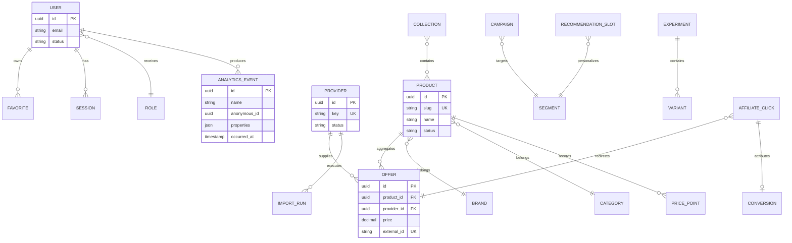

# Arquitetura Garimpo

## Visão geral

Garimpo é um modular monolith em Next.js 16. A aplicação pública, o admin e a API compartilham contratos de domínio, mas as dependências externas ficam atrás de `Repository`, `ProviderAdapter`, `EventTracker` e `RecommendationEngine`. O modo atual é `mock`: browser state para experiência demonstrativa e singleton server-side para APIs; a troca futura preserva os contratos e substitui apenas adapters.

## Decisões técnicas

| Decisão | Escolha | Motivo | Alternativa rejeitada | Impacto futuro |
|---|---|---|---|---|
| Arquitetura | Modular monolith | Transações simples e baixo custo operacional | Microservices imediatos | Módulos podem ser extraídos por boundary quando volume justificar |
| Web e API | Next.js App Router | RSC, SEO e Route Handlers no mesmo deploy | SPA + API separada | APIs `/api/v1` já definem boundary externo |
| Dados futuros | PostgreSQL/Neon | Relacional, transacional e adequado ao catálogo | Documento como fonte primária | Drizzle pode implementar os repositories sem alterar UI |
| Auth futura | Better Auth | Sessão segura e integração com PostgreSQL | Auth client-only | `AdminRole` será persistido por usuário e organização |
| Assíncrono | Fila por tópicos | Retry e idempotência isolados | Processamento no request | Mock queue pode virar Workflow/Queues sem mudar producers |
| Eventos | Domain events separados de analytics | Evita acoplamento entre negócio e mensuração | Um único barramento de eventos | Outbox pode ser acrescentado no commit transacional |
| Cache | Cache-aside com namespace e TTL | Invalidação explícita e simples | Cache global indiscriminado | Pode migrar para Redis/KV apenas nos pontos quentes |
| Monorepo | Root app + workspace packages | Evolução incremental sem mover a aplicação | Migração estrutural disruptiva | Novos apps/workers entram em `apps/*`; contratos ficam em `packages/*` |

## Estrutura

```text
app/                      Next.js web, admin e API v1
components/               UI por domínio e shell
lib/
  auth/                    RBAC e futura sessão
  platform/                contratos e adapters browser
  server/                  adapters server, cache, ingestão e estado mock
packages/
  contracts/               contrato compartilhável do workspace
docs/                      decisões e modelos
```

Estrutura-alvo quando houver segundo deploy: `apps/web`, `apps/worker`, `packages/contracts`, `packages/domain`, `packages/config`. A aplicação atual permanece na raiz para evitar uma migração sem benefício operacional.

## ERD alvo



Toda entidade pertencente a usuário ou organização terá `user_id`/`organization_id`; queries no Neon serão sempre escopadas. Identificadores externos usam unique constraints compostas por provider.

## Módulos e contratos

- Catalog: produtos, marcas, categorias e coleções.
- Offers: ofertas, estoque, histórico e comparação.
- Providers: capabilities, autenticação externa, sync e normalização.
- Affiliate: links, click ID, sub IDs e conversões.
- Identity: usuário, sessão, consentimento e RBAC.
- Analytics: eventos de interação e rollups.
- Recommendation: candidatos, ranking, slots e explicações.
- Growth: segmentos, campanhas e experimentos.
- Operations: jobs, logs, auditoria e integrações.

Contratos públicos estão em `lib/platform/contracts.ts`, `lib/auth/rbac.ts` e no workspace `@garimpo/contracts`. APIs retornam envelope `{ data, meta }`; erros usam `{ error: { message, details }, meta }`.

## Provider Adapter

Cada adapter declara `key`, `name`, `health` e `sync`. O pipeline externo é: fetch fora de transação, validação, normalização, matching, revisão dos casos ambíguos, persistência curta e publicação de evento. O endpoint exige `Idempotency-Key`; external IDs impedem duplicação.

Matching combina tokens normalizados, marca e categoria. Confiança abaixo de 0,78 exige revisão humana. Embeddings podem entrar como sinal adicional, nunca como decisão opaca única.

## Event architecture

Domain events: `ProductCreated`, `ProductUpdated`, `OfferUpdated`, `PriceChanged`, `AffiliateClicked`, `ConversionReceived`, `FavoriteAdded`. Eles representam fatos do negócio e podem gerar jobs.

Analytics events: `page_view`, `search`, `product_view`, `favorite_add`, `compare_add`, `affiliate_click`, `consent_updated`. Eles medem comportamento, respeitam consentimento e aceitam amostragem.

Envelope comum: `id`, `type/name`, `aggregateId/resource`, `occurredAt/timestamp`, `actor/anonymousId`, `payload/properties`, `schemaVersion`. No banco real, eventos críticos são escritos em outbox na mesma transação; um worker publica e marca como entregue.

## Tracking e atribuição

O redirect gera `click_id`, armazena provider, offer, campanha, experimento e sub IDs, então redireciona. Conversões chegam por webhook assinado e idempotente. Atribuição padrão é last eligible click em janela configurável; dados brutos permanecem auditáveis e rollups são derivados.

## Recommendation Engine

Pipeline: elegibilidade → geração de candidatos editorial/comportamental/similaridade/trending → filtros de disponibilidade e diversidade → ranking ponderado → regras de campanha → explicação → impressão. Fallbacks são coleção editorial, trending da categoria e popular global. Experimentos versionam algoritmo e pesos; métricas incluem CTR, conversão, diversidade e cobertura.

## Cache

- Catálogo público: 5 minutos, invalidação por `product:*` e `category:*`.
- PDP/ofertas: 1 minuto, invalidação em `OfferUpdated` e `PriceChanged`.
- Recomendações: 2 minutos por perfil/slot/versão.
- Rollups: 30 segundos no admin.
- Sessão e permissões: não armazenar em cache público.

O mock implementa cache-aside com TTL. Em produção, usar cache do Next.js para conteúdo público e Redis apenas se houver necessidade de estado distribuído, rate limit ou filas.

## Jobs

Tópicos: `provider.import`, `offer.normalize`, `product.match`, `analytics.rollup`, `affiliate.conversion`, `recommendation.refresh`, `privacy.export`, `privacy.delete`. Cada job leva idempotency key, tentativas, status, timestamps e correlation ID. Retry usa backoff; falhas permanentes vão para dead letter review. Chamadas externas nunca ficam dentro de transação longa.

## Segurança

- Better Auth com cookie HttpOnly, Secure e SameSite apropriado.
- RBAC deny-by-default no servidor; esconder controles na UI é apenas UX.
- Validação de payload, queries parametrizadas, rate limits e limites de tamanho.
- Webhooks autenticados por assinatura e proteção contra replay.
- Segredos somente no runtime Vercel; tokens nunca no client.
- Audit log append-only para mutações administrativas.
- Headers defensivos configurados no Next.js; CSP começa report-only e evolui após inventário de origens.
- Threats prioritárias: takeover de admin, SSRF em providers, injeção em feeds, open redirect afiliado, fraude de conversão e exfiltração de eventos.

## LGPD

Consentimento é versionado por finalidade. Eventos não essenciais são bloqueados sem opt-in. Exportação, correção e exclusão viram jobs auditáveis. Identificadores analíticos são pseudonimizados; retenção padrão do mock é 90 dias. Dados necessários a fraude, fiscal ou auditoria são minimizados e retidos sob base legal documentada.

## SEO

Páginas de produto, categoria, coleção e guia têm metadata dinâmica, canonical e Open Graph. Produtos publicam JSON-LD `Product`/`AggregateOffer`; sitemap inclui rotas indexáveis e robots bloqueia admin, conta e redirect. Filtros combinatórios permanecem canonicalizados para evitar páginas duplicadas.

## Deploy

Um projeto Vercel executa web e API. Neon, Better Auth e fila serão conectados por adapter. Migrações são executadas antes do tráfego; deploys usam preview, smoke tests e rollback por versão. Workers podem ser extraídos para app separado mantendo `@garimpo/contracts`.

## Testes

- Unit: normalização, matching, RBAC, idempotência e cache.
- Integration: Route Handlers, envelopes, autorização e webhooks.
- E2E: busca, favorito, comparação, saída afiliada, CRUD, builder, papel somente leitura e jobs.
- Quality gates: TypeScript, build, acessibilidade por jornada e screenshots desktop/mobile.

## Roadmap

1. Foundation real: Neon, migrations, Better Auth, repositories e auditoria.
2. Catálogo: adapters reais, ingestão e matching assistido.
3. Tracking: redirect seguro, eventos e conversões.
4. Personalização: perfis, segmentos e slots.
5. Growth: campanhas e experimentos.
6. Escala: outbox, fila distribuída, rollups incrementais e observabilidade.
